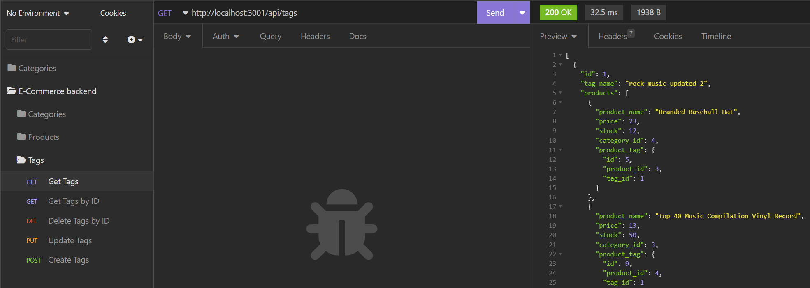

# E-Commerce-Back-End

### Github : https://github.com/Tsedi28/E-Commerce-Back-End

### Walkthrough video : https://drive.google.com/file/d/1c_o0Q_JhBfK7A-y5ZYPZxc3XGm8eipNB/view

## Description:

This application was made to provide companies with the best back-end code to help run an e-commerce website. E-commerce generates trillions of dollars so having a working back-end code can help make money and the better the code the better it is to view data.

## Table of Contents

- [Installation](#installation)
- [Usage](#usage)
- [License](#license)
- [Contributor](#contributor)
- [Tests](#tests)

## Installation:

To install, the user needs to clone the repo and have Node installed. Once that is done the user can run the command to start the server and view the data on insomnia.

## Usage:

## License:

This project is license under Apache

## Tests:

npm run seed, npm start

## Contributor:
Tsedenia Bogale ©2022 All Rights Reserved.
- - -